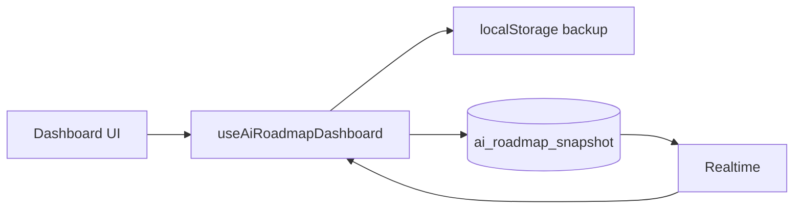

# Supabase setup — AI roadmap live dashboard

This connects **`/airoadmapdashboard`** to a shared Supabase row so the whole team sees the same progress, blocks, and automations in real time.

---

## What you need from Supabase

| Item | Where to find it | Env variable |
|------|------------------|--------------|
| Project URL | Dashboard → **Project Settings** → **API** → Project URL | `VITE_SUPABASE_URL` |
| Anon public key | Same page → **anon** `public` key | `VITE_SUPABASE_ANON_KEY` |

Optional later (not required for v1):

| Item | Use |
|------|-----|
| Project ref (e.g. `abcdefghijklmnop`) | CLI / MCP migrations |
| Service role key | **Never** in the browser — server-only scripts |
| Personal access token | Supabase CLI / MCP automation |

---

## 1. Create or pick a project

1. [supabase.com/dashboard](https://supabase.com/dashboard) → **New project** (or use an existing Axxiom project).
2. Note the **region** and wait until the database is healthy.

---

## 2. Run the database migration

**Option A — SQL Editor (fastest)**

1. Open **SQL Editor** → **New query**.
2. Paste the contents of:

   `supabase/migrations/20260522120000_ai_roadmap_dashboard.sql`

3. Click **Run**.

You should get table `public.ai_roadmap_snapshot` with one row `workspace_id = 'axxiom'`.

Then run the **image storage** migration (automation screenshots in the detail panel):

`supabase/migrations/20260523120000_ai_roadmap_automation_images.sql`

This creates public bucket `ai-roadmap-automations` (5 MB max, JPEG/PNG/WebP/GIF).

If upload shows **“new row violates row-level security policy”**, run:

`supabase/migrations/20260524120000_fix_ai_roadmap_storage_rls.sql`

**Option B — Supabase CLI**

```bash
npx supabase login
npx supabase link --project-ref YOUR_PROJECT_REF
npx supabase db push
```

---

## 3. Enable Realtime (required for live updates)

1. **Database** → **Publications** (or **Replication** on older UI).
2. Open publication **`supabase_realtime`**.
3. Add table **`public.ai_roadmap_snapshot`**.

Without this, saves work but other browsers won’t update until refresh.

---

## 4. Configure the portal env

Copy `.env.example` → `.env.local` and add:

```env
VITE_SUPABASE_URL=https://YOUR_PROJECT_REF.supabase.co
VITE_SUPABASE_ANON_KEY=eyJhbGciOiJIUzI1NiIsInR5cCI6IkpXVCJ9...

# Hub password — use DOUBLE quotes if it contains $ or #
VITE_HUB_PASSWORD="your-password-here"
```

Restart the dev server after any env change:

```bash
npm run dev
```

Open `/airoadmapdashboard`. The bar at the top should show **Live** / **Last synced …** instead of “Local only”.

---

## 5. Netlify production

**Site configuration → Environment variables** — add the same three names:

- `VITE_SUPABASE_URL`
- `VITE_SUPABASE_ANON_KEY`
- `VITE_HUB_PASSWORD`

Trigger a **new deploy** (Vite bakes `VITE_*` in at build time).

---

## How sync works in the app



- **Load:** fetch `ai_roadmap_snapshot` for `workspace_id = 'axxiom'`.
- **Empty DB:** seed from localStorage (if any), then upsert to Supabase.
- **Edits:** debounced upsert (~600ms) + localStorage cache.
- **Other users/tabs:** Realtime `postgres_changes` applies remote payload when `updated_at` is newer.

---

## Security model (read this)

| Layer | What it does |
|-------|----------------|
| Hub password (`VITE_HUB_PASSWORD`) | Blocks casual access to the whole portal |
| RLS policy | Allows `anon` + `authenticated` read/write only for `workspace_id = 'axxiom'` |
| Anon key in browser | Normal for Supabase SPAs; relies on RLS |

This is appropriate for an **internal** strategy hub already behind a password. For stricter control:

1. Enable **Supabase Auth** (e.g. team emails).
2. Replace the RLS policy with `auth.role() = 'authenticated'` (or org-scoped claims).
3. Keep the hub password as an extra gate if you want.

Do **not** put the **service role** key in `VITE_*` or commit it to git.

---

## Troubleshooting

| Symptom | Fix |
|---------|-----|
| “Local only” on dashboard | Set both `VITE_SUPABASE_*` vars and restart `npm run dev` |
| Hub password always wrong | Use **double quotes** in `.env.local` if password has `$` or `#` |
| Sync error / 401 / 403 | Re-run migration; confirm RLS policy exists; check anon key |
| Saves work, no live updates | Add table to **supabase_realtime** publication |
| Empty dashboard after migration | Normal — first edit seeds data; or import from localStorage automatically on first load |
| Wrong data after reset | “Reset defaults” overwrites state locally then syncs to Supabase for everyone |

---

## Schema reference

```sql
ai_roadmap_snapshot (
  workspace_id  text PK     -- always 'axxiom' for this portal
  payload       jsonb       -- full RoadmapDashboardCategory[] tree
  updated_at    timestamptz
  updated_by    text        -- optional, reserved
)
```

`payload` matches the TypeScript shape: categories → blocks → `subItems` (automations).

---

## What to send if you want help wiring a specific project

1. Supabase **project ref** (not the service role key).
2. Confirmation that the migration SQL ran without errors.
3. Confirmation Realtime is enabled on `ai_roadmap_snapshot`.
4. Whether Netlify or local-only — and the exact sync error from the dashboard bar (if any).

Do **not** share service role keys or hub passwords in chat/logs.
